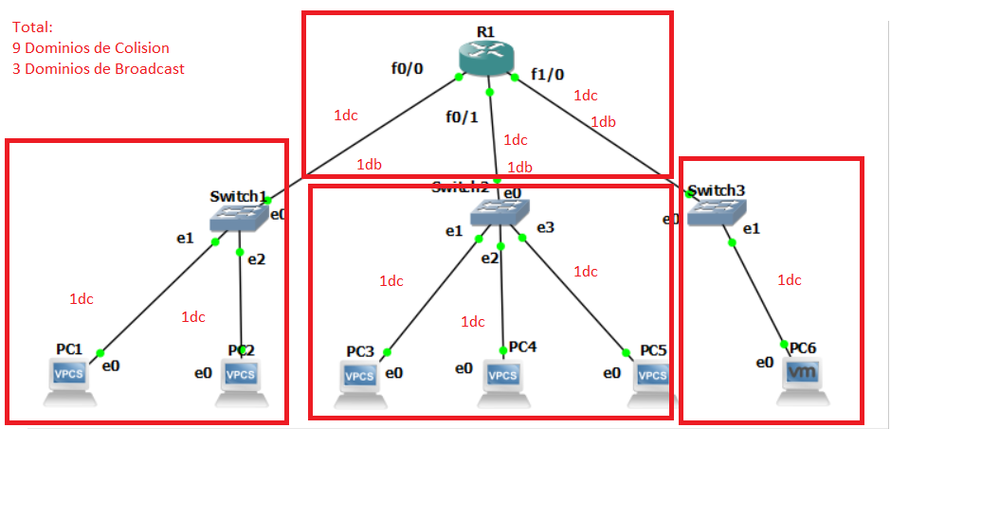
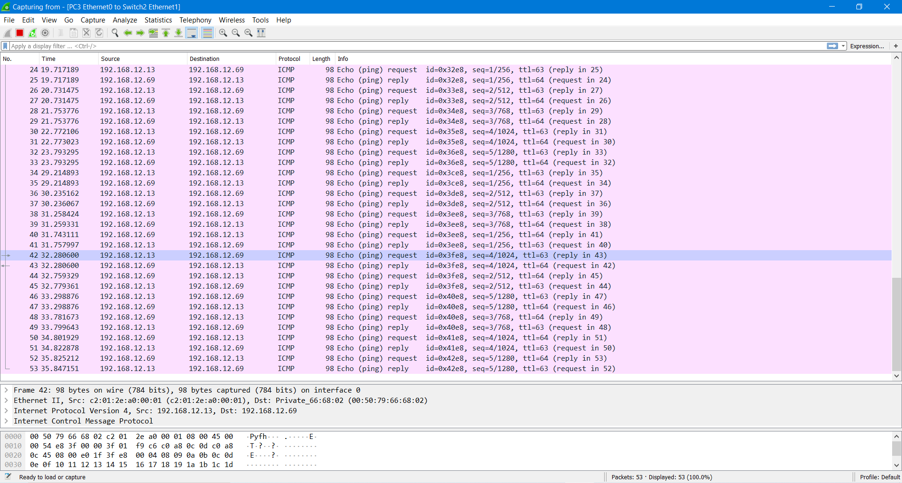

# Practica 2 - Redes de computadoras 1

## Cálculos de dominio de broadcast y dominios de colisión

  En base a la teoria del curso, en donde se tiene que:
  SWITCH: n Dominios de colision ( n = numero puertos conectados)
          1 Dominio  de Broadcast
  ROUTER: 1 Dominio de Colision por cada puerto conectado
          1 Dominio de Broadcast por cada puerto
          
  Y que finalmente, el switch comparte el mismo dominio de broadcast que el router. Se llego a la siguiente cuenta: 
  
  
## Capturas de paquetes en cada dispositivo de red utilizado.
  - PC1 - Switch
  

  - PC2 - Switch
  
  
  - PC3 - Switch
    
  
  - PC4 - Switch
  
  
  - PC5 - Switch
    
  
  - PC6 - Switch
  
