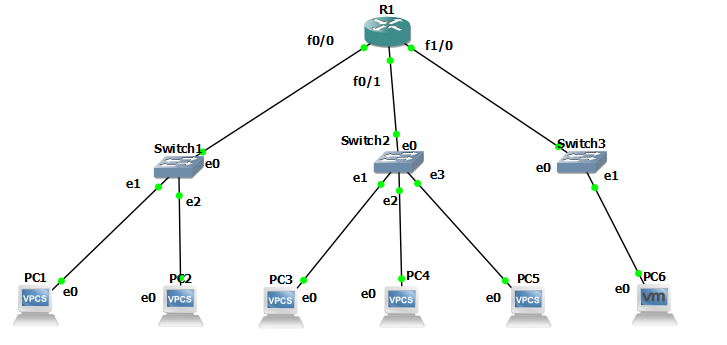
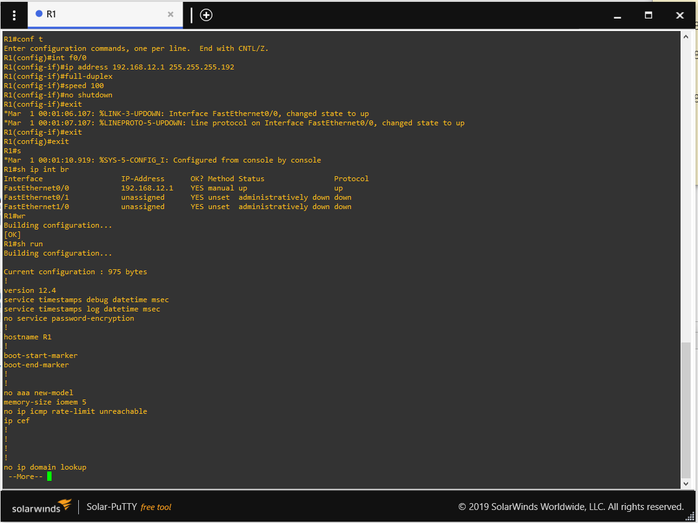
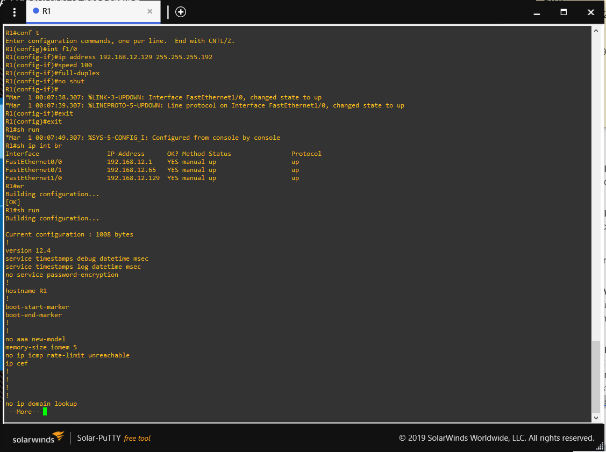
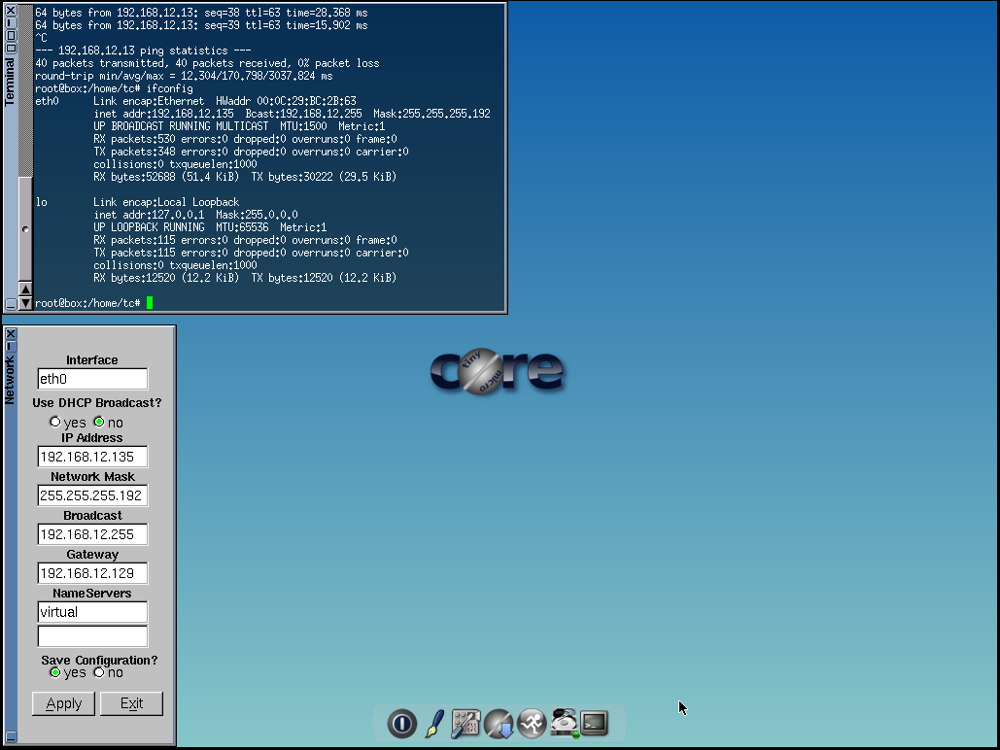
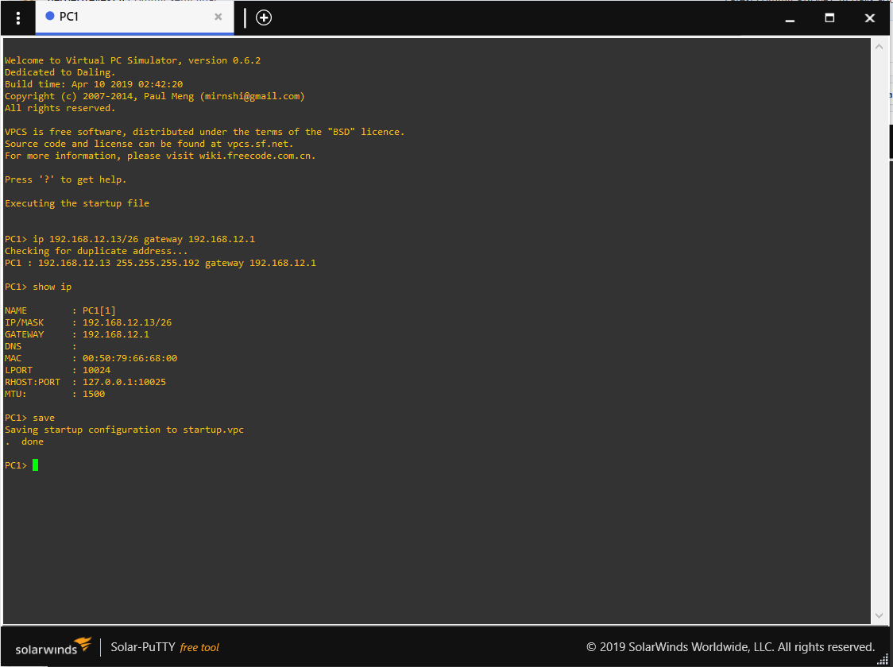
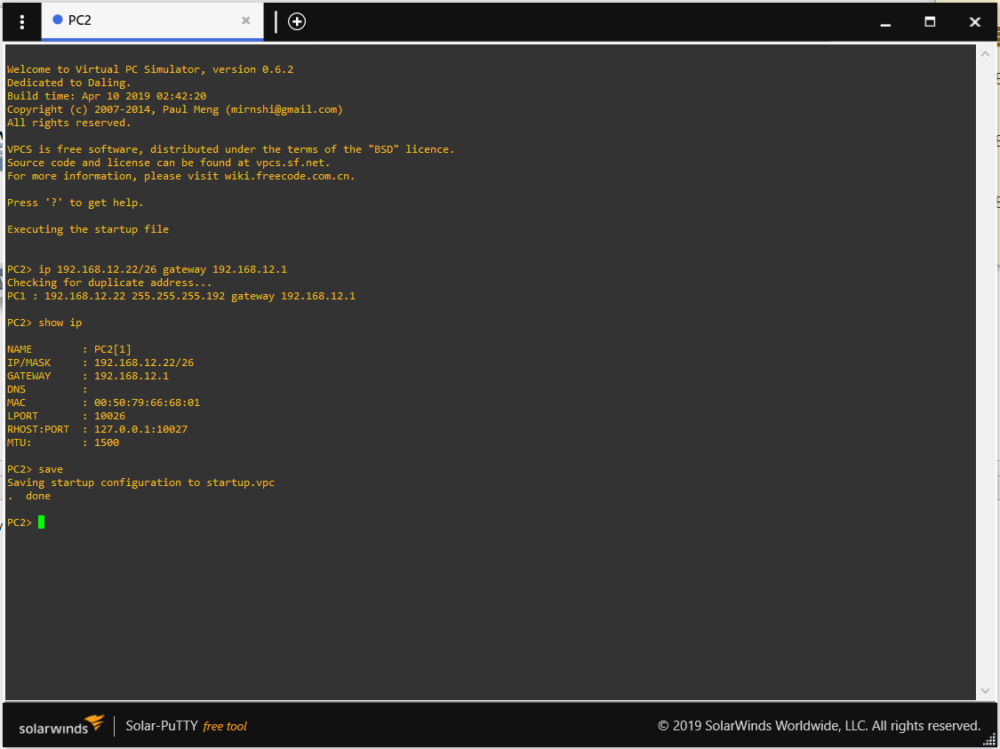
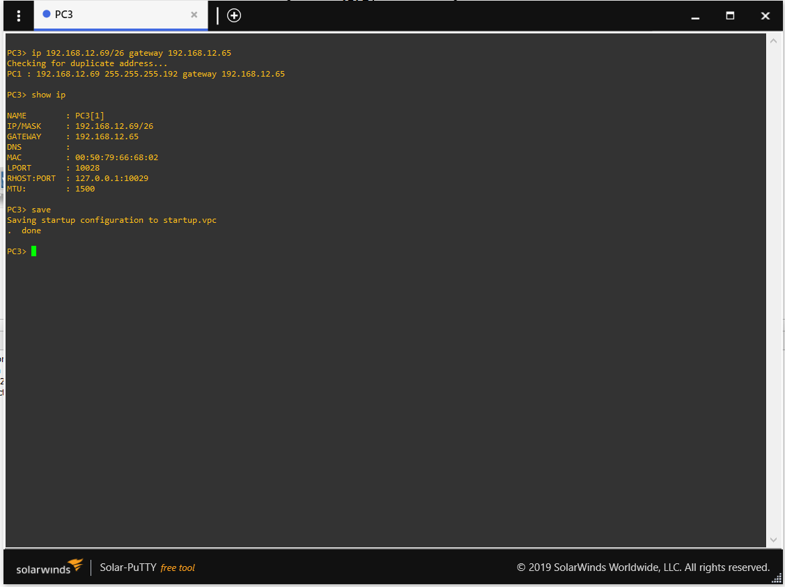
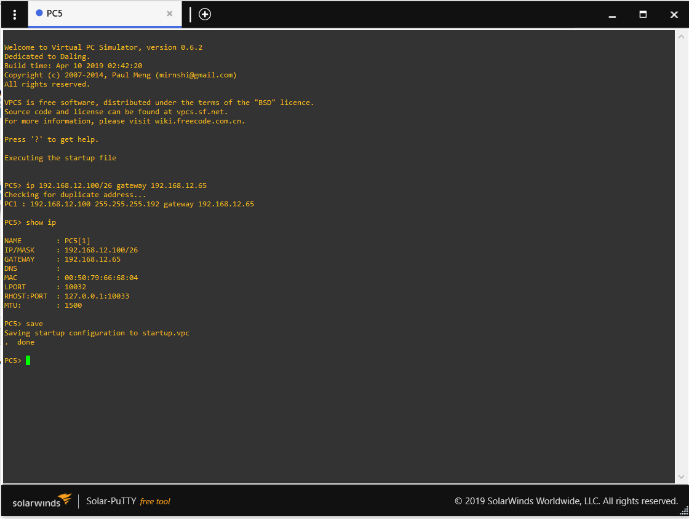

# Practica 2 - Redes de computadoras 1

Esta practica consiste en que debe configurar y administrar los dispositivos de una nueva infraestructura de red. La empresa tiene operando 6 máquinas. Cada una de estas tendrá su propia subred para poder llevar una mejor gestión y control de cada departamento, pero también se necesitan que todas puedan comunicarse entre sí por medio de 1 router.

Las configuraciones necesarias para poder realizar esta practica, seran mostradasa continuacion paso a paso. 
## Configuración de la topologia
  - Paso 1
  Armamos la topologia como se muestra a continuacion, para luego poder ir realizando las diferentes configuraciones que se describiran. 
  
  
  - Paso 2
  Procedemos con la configuracion del router, para esto vamos a configurar las interfaces. Los comandos a ingresar son:
    * conf t <--- para iniciar en modo de configuracion
    * int f0/0 <-------- Para seleccionar la interfaz a asignarle la ip
    * ip address 192.168.12.1 255.255.255.192 <---- definimos la direccion ip 
    * no shut
    * exit <------ salimos del modo de configuracion
    * rw <------ sirve para guardar todos los cambios
    * sh run 

  - Paso 3
  Realizamos lo mismo que en el paso 2, solamente que se cambia a int f0/1 y la direccion ip seria 192.168.12.65 255.255.255.192

  - Paso 4
  Realizamos lo mismo que en el paso 2, solamente que se cambia a int f1/0 y la direccion ip seria 192.168.12.129 255.255.255.192

  - Paso 5
  Procedemos a configurar la maquina virtual, solamente accedemos a panel de control luego network y en IP Address le asignamos la direccion IP: 192.168.12.135, configuramos el gateway que seria 192.168.12.129 y la mascara de subred que seria 255.255.255.192 y le damos en apply para ver que los cambios de han guardado. 

  - Paso 6
  Procedemos a configurar VPC1, el comando a  utilizar es: ip direccion_ip/mascara_subred gateway, en el caso de esta seria 192.168.12.13/26 192.168.12.1 

  - Paso 7
  Procedemos a configurar VPC2, el comando a  utilizar es: ip direccion_ip/mascara_subred gateway, en el caso de esta seria 192.168.12.22/26 192.168.12.1 

  - Paso 8
  Procedemos a configurar VPC3, el comando a  utilizar es: ip direccion_ip/mascara_subred gateway, en el caso de esta seria 192.168.12.69/26 192.168.12.65 

  - Paso 9
  Procedemos a configurar VPC4, el comando a  utilizar es: ip direccion_ip/mascara_subred gateway, en el caso de esta seria 192.168.12.74/26 192.168.12.65 

  - Paso 10
  Procedemos a configurar VPC5, el comando a  utilizar es: ip direccion_ip/mascara_subred gateway, en el caso de esta seria 192.168.12.100/26 192.168.12.65 

  - Conclusion
 Finalmente ya tenemos la topologia completa, lista para que se tenga comunicacion entre las computadoras. 
